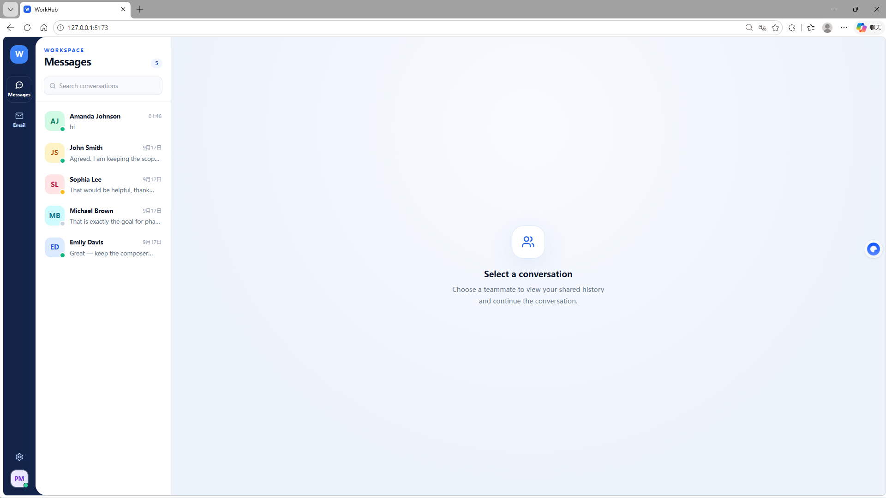
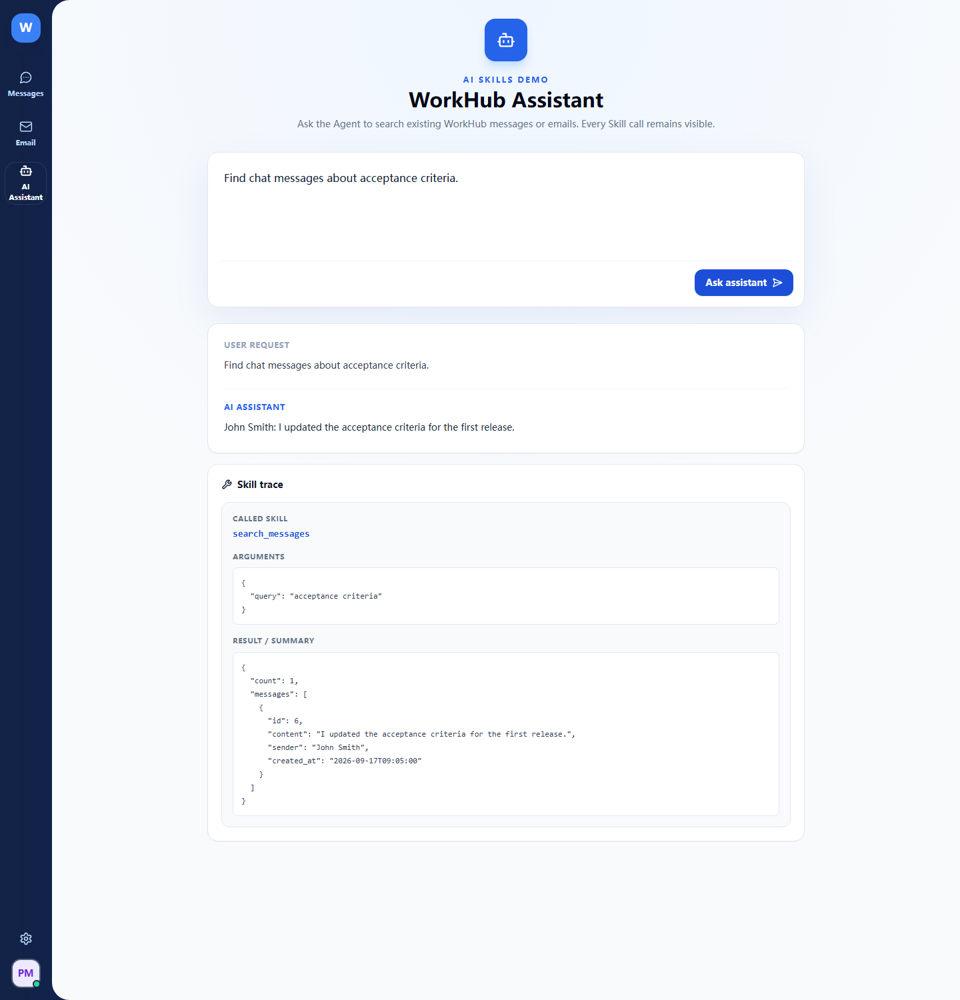
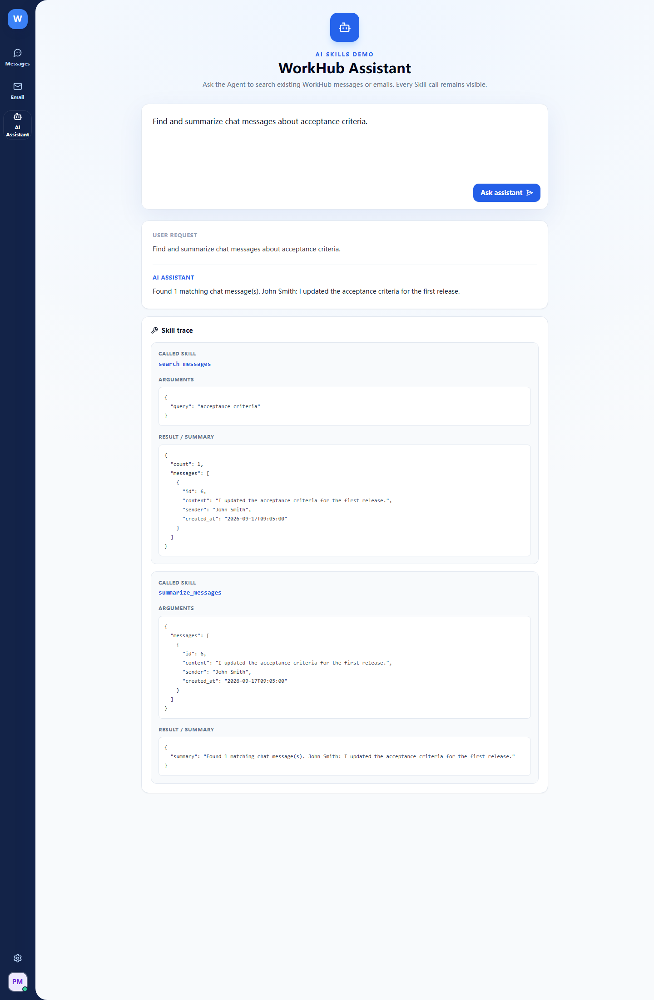
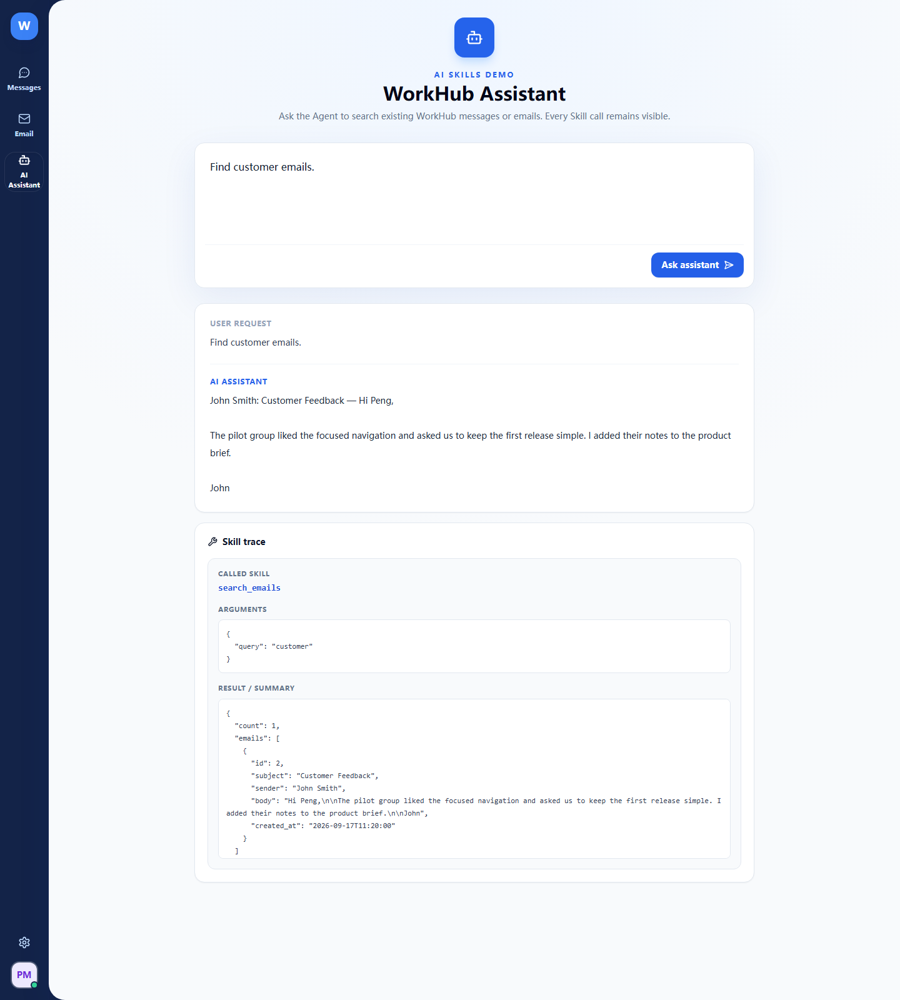
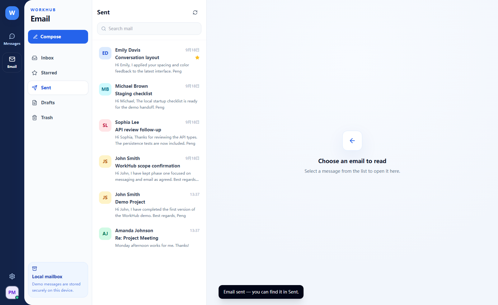

# WorkHub Demo

[English](README.md) | [简体中文](README.zh-CN.md)

> A lightweight enterprise collaboration demo featuring messaging, email, and an explainable AI Skills showcase.

WorkHub is a portfolio-ready, desktop-first collaboration product inspired by modern team chat and mail clients. It keeps the original direct-messaging and local-email workflows intact, then demonstrates how those existing business capabilities can be exposed as reusable AI Skills.

## Features

### Messaging

- Five seeded teammates with presence, role, last-message, and unread indicators
- Persistent one-to-one conversation history
- Optimistic message sending through a REST API
- Read-state updates when a conversation is opened

### Email

- Inbox, Starred, Sent, Drafts, and Trash folders
- Three-pane mailbox layout with unread and starred states
- Email detail, reply, forward, compose, and delete-to-trash flows
- Provider-ready `EmailService` boundary for future Gmail, IMAP, or Microsoft Graph adapters

### AI Assistant

- Natural-language routing to existing WorkHub message and email capabilities
- Visible Skill name, arguments, and returned result for every Agent request
- Simple message-result summarization without requiring an external API key

### Contacts and persistence

- Realistic company profiles and workplace content
- SQLite database created and seeded automatically on first startup
- SQLAlchemy models designed for a straightforward future PostgreSQL migration

## Tech Stack

| Layer | Technology |
| --- | --- |
| Frontend | React, TypeScript, Vite, Tailwind CSS, shadcn/ui-style Radix primitives, Lucide Icons |
| Backend | Python, FastAPI, SQLAlchemy, Pydantic |
| Database | SQLite |
| Agent | Deterministic intent routing over explicit Skills |
| Testing | Pytest, Vitest, Testing Library |

## Architecture

```text
Browser (React + TypeScript)
        | REST / JSON
        v
FastAPI routers
        |
        +-- MessageService
        +-- EmailService
                 |
                 v
        SQLAlchemy models
                 |
                 v
              SQLite
```

The repository keeps UI components, API access, domain types, routers, schemas, services, models, seed data, Skills, and Agent routing in separate modules. The frontend development server proxies `/api` requests to FastAPI, so no local environment variable is required for the standard setup.

## AI Skills Demo

WorkHub already had enterprise collaboration features before this upgrade. This change does not rebuild those features. Instead, it wraps the existing `MessageService` and `EmailService` capabilities in a small Skill layer that the Agent can select and call.

```text
User
  |
  v
AI Assistant
  |
  v
Agent
  |
  v
Skills
  +-- search_messages(query)
  +-- search_emails(query)
  +-- summarize_messages(messages)
  |
  v
Existing WorkHub Services
  +-- MessageService
  +-- EmailService
```

The Agent uses clear routing rules rather than a workflow engine or multi-Agent framework. Requests about email call `search_emails`; chat requests call `search_messages`; summary requests first search messages and then call `summarize_messages`. The API response includes each Skill call, its arguments, and its result so the execution path is easy to demonstrate in an interview.

The current demo uses deterministic intent routing to keep the Skill invocation process observable and reproducible. The routing layer can later be replaced with LLM tool calling without changing the underlying business Skills.

## Quick Start

### Backend

```bash
cd backend
python -m venv .venv

# Windows PowerShell
.venv\Scripts\Activate.ps1

# macOS / Linux
source .venv/bin/activate

pip install -r requirements.txt
uvicorn app.main:app --host 127.0.0.1 --port 8010 --reload
```

Backend: [http://127.0.0.1:8010](http://127.0.0.1:8010)

FastAPI docs: [http://127.0.0.1:8010/docs](http://127.0.0.1:8010/docs)

### Frontend

Open a second terminal:

```bash
cd frontend
npm install
npm run dev
```

Frontend: [http://localhost:5173](http://localhost:5173)

## Demo Account

| Name | Role | Email |
| --- | --- | --- |
| Peng Ma | Software Engineer | `peng@workhub.demo` |

Authentication is intentionally outside this demo; the app opens directly as Peng Ma.

## Demo Flow

1. Open **Messages** and show that WorkHub already has persistent business data.
2. Open **AI Assistant**.
3. Ask `Find chat messages about acceptance criteria.` and point out `search_messages`, its `query`, and the returned message data.
4. Ask `Find and summarize chat messages about acceptance criteria.` and show the sequential `search_messages` and `summarize_messages` calls.
5. Ask `Find customer emails.` or `查一下客户邮件` and show that the Agent switches to `search_emails` and reuses the existing email service.
6. Return to **Messages** or **Email** to show that the original workflows still work.

## Tests and Build

```bash
# Backend
cd backend
pytest -q

# Frontend
cd frontend
npm test -- --run
npm run build
```

The tests cover the original messaging and email flows, Agent Skill selection, Skill results, the AI Assistant trace, and the production frontend build.

## Screenshots

### WorkHub Messages



### AI Assistant calling `search_messages`



### AI Assistant calling `search_messages` + `summarize_messages`



### AI Assistant calling `search_emails`



### WorkHub Email



## API Overview

| Method | Endpoint | Purpose |
| --- | --- | --- |
| `GET` | `/api/contacts` | List contacts with conversation summaries |
| `GET` | `/api/conversations/{contact_id}` | Load a direct-message history |
| `POST` | `/api/messages` | Send a direct message |
| `GET` | `/api/emails?folder=inbox` | List a mailbox folder |
| `GET` | `/api/emails/{id}` | Open an email and mark inbox mail as read |
| `POST` | `/api/emails` | Compose or save an email |
| `POST` | `/api/emails/{id}/reply` | Reply to an email |
| `DELETE` | `/api/emails/{id}` | Move an email to Trash |
| `POST` | `/api/agent/chat` | Route a request to WorkHub Skills and return the trace |

## Current Limitations

- Agent routing and summaries are deterministic rules, not LLM-generated reasoning.
- There is no authentication, authorization, or multi-tenant isolation.
- Search is simple database text matching rather than semantic/vector search.
- The demo does not include Redis, background jobs, MCP, RAG, WebSocket realtime messaging, or external email providers.

## Future Roadmap

- Real-time messaging
- Gmail / Outlook integration
- Calendar
- Optional LLM tool-calling provider
- Semantic retrieval for larger knowledge sources
- Authentication and role-based access control
